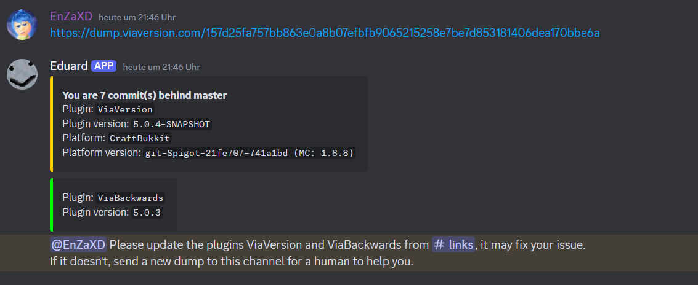
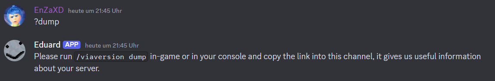

# Eduard
A Discord bot used to manage the ViaVersion Discord server.

## Features
- Print information about a ViaVersion dump url.
- Support commands for moderators starting with "?" (see [here](https://florianreuth.de/viaversion) for an overview).
- Automatically detect common messages and respond to them.
- Integration of [Athena](https://github.com/Jo0001/Athena) for automatic log analysis & proxy build check.

## ViaVersion dump information

Red = Outdated release,\
Green = Latest release,\
Orange = Outdated CI build,\
Blue = Latest CI build,\
Gray = Unknown version,\
Magenta = Unknown commit hash. Fork?

The versions used to check against latest releases are stored in the [config](src/main/resources/config.yml) file.

The data stored inside dumps can be found in the ViaVersion source code, see [here](https://github.com/ViaVersion/ViaVersion/tree/master/common/src/main/java/com/viaversion/viaversion/dump).

## Support messages

They start with `?` and can be used to answer common questions easier and faster.\
They are located in the [messages.json](messages.json) and are automatically synced with the GitHub repository.

## Configuration
The configuration file is located at `src/main/resources/config.yml`. It contains the channel and other server related ids.

## Requirements
* Java 11 or greater
* A `tessdata` directory with trained OCR data *(https://github.com/tesseract-ocr/tessdata, eng.traineddata should suffice)*

## License
This project is licensed under the [GNU Public License v3](LICENSE).